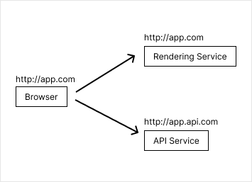

# Server Side Render 如何實作 Login System？

現在前端應用 Server Side Render 當道，不是要 Nextjs 就是 Nuxtjs，各種 SSR 框架四起。但大家口中這個「Server Side Render」到底是什麼？或許你會去 Google 查 SSR 是什麼，但你得到的資訊可能會更混亂。我提供幾個不錯直得閱讀的文章，可以做一個前置了解。

- [Huli Blog](https://blog.huli.tw/2023/11/27/server-side-rendering-ssr-and-isomorphic/)
- [Shubo 的程式開發筆記](https://www.shubo.io/rendering-patterns/)
- [Vue.js](https://vuejs.org/guide/scaling-up/ssr.html)
- [Next.js](https://nextjs.org/docs/pages/building-your-application/rendering/server-side-rendering)

看完也許你更清楚了，我們再往下說。如果你還是不懂，我建議你可以先開一個前端的 Server Side Render 專案體驗看看，而不是使用 Backend 的解決方案。

## 重新定義「前端」與「後端」

現在前端與後端的界線越來越模糊，不再是「瀏覽器」與「伺服器」這樣單純的二分切法，這是一個更大的議題。以這幾年下來，我所認知的前端是「客戶端」，而後端是「服務端」。

蛤？客戶端？服務端？

到這裡我想你還是滿頭問號，所以我要先定義客戶端與服務端是什麼。客戶端就是處理使用者（用戶）的互動問題，而服務端是處理資料或功能的地方，但不關心用戶的情境。所以大概能歸納，渲染、事件、互動、終端設備等等問題都是「大前端」領域。誒？那這樣真是包山包海誒！！！硬要扯當然連 Native App 都是屬於前端一環。對於一個「Web Frontend Developer」來說，最重要不外乎就是管理「渲染」這個議題。

渲染這件事不只是「瀏覽器」的事，伺服器也可以「渲染」我們瀏覽器要的 HTML 呀！這就是 SSR 啊！但又為什麼不能使用純粹的「後端」策略呢？因為當今除了前端框架提供的方案外，還沒有後端框架能同時提供 Hydration，所以不具備 Hydration 的後端框架算不上一套現代的 SSR 框架。

那又為什麼非得是 JavaScript 不可？其實不無不可，當今主流的瀏覽器只能運行 JavaScript，CSR 當然是 JavaScript 最為直覺，而你應該也不會想要伺服器寫一次 View，瀏覽器再一份 View 這樣兩套維護吧！

後端專注解決資料庫、三方服務、系統架構，而前端使用後端提供的抽象介面去組合出複雜的資訊與邏輯，處理畫面渲染與各種使用者互動。這就是「前端」的工作，這也是過去經常講到的「MVVM」架構，這也是大家追求的「前後端分離」架構。所以好的前後端分離最開心的不只是前端，後端也可以專注在資料庫優化與多方服務的整合系統。

## 所以，說好的 Login System？

別急別急～～這裡開始要來談談進來這篇大家最關心的 Login 這件事。

## 分析 SSR 問題點

過去我們前端很習慣使用 JWT Token，先登入後取得 JWT Token，然後存進 LocalStorage 在瀏覽器持久化保存。當取得重要資訊時要先提供 Token，在 HTTP Request Headers 的 Authorization 放入 JWT Token 供後端驗證。看起來很合理，但實際上有一個巨大的盲點，就是「LocalStorage 只存在於瀏覽器」。在 SSR 中我們要渲染 HTML 時是在 Server，姑且稱呼 Rendering Service，這時是沒有 Browser API 能呼叫的，自然我們請求 API 時只能依靠瀏覽器預設發生頁面請求能帶的資訊來作為基本判斷。

所以就有幾個必然的情況：

- 只能用預設瀏覽器輸入完網址直接發出的資訊
- 只會有 GET
- 只能取得預設的 Headers
- 不能用 JavaScript 預處理操作

很明顯，連 JavaScript 都不能操作請求就被發出去了，根本無法代入 Token。

### 基本的解決方案

但解決方案也沒有那麼複雜，很簡單，使用 Cookie 吧！

Cookie 一直都是一個神奇的解決方案，他能夠跨越前後端的隔閡。只要任何 HTTP Request 到達伺服器，伺服器在 Response 的 Headers 中的 `set-cookie` 加上要記錄的資訊，這些資訊就可以隨著請求把資訊帶回去給瀏覽器，瀏覽器就會把它暫時記錄下來，甚至可以設定存活時間。直到下一次瀏覽器再次發出請求，這個暫存資訊就會隨著 HTTP Request 夾帶在 Headers 中的 `cookie` 一起帶去伺服器，如此一來就可以判斷這筆請求是來自於哪個使用者端。而伺服器為了統管這個資訊，大部分後端框架實作了一個機制叫做「Session」，所以人稱好兄弟 Cookie/Session 就是這樣來的。

那如果這套機制是瀏覽器全自動做的，那就不需要操作 JavaScript，那就符合上述條件。這時你的系統架構就會長這樣，瀏覽器會去向你的 Rendering Service 做請求，有任何外部 API 需求再向 API Service 請求，這時 Token 也可以在 Proxy 過程中進行處理。

這裡就有一個小小的坑，如果再將請求利用 Proxy 向外部發出請求，那 cookie 很有可能會消失，這時得手動將 cookie 補上。但如果要做到 SSO + JWT，那可能要將 cookie 轉換成真正的 JWT Token(因為放在 cookie 的可以不是 SSO 的 Token)，再轉換帶入 Headers 的 Authorization。這個行為就很有可能要在 Proxy 的 middleware 去加工。

### 大流量架構

為了處理大量的請求，漸漸會需要採用微服務架構，同一個功能的服務需要啟動多個實體去承載請求。這時 Rendering Service 和 API Service 就會啟動多個實體，那就需要依賴 Load Balancer Service 去幫忙分配到對應的服務上。常見的 Load Balancer Service 可以用像是 Nginx, Apache, Kubernetes 之類的工具，就可以用單入口多服務或多入口多服務的方式去傳遞請求。

這樣的架構有很高的橫向擴展能力，會是一個常見的前端微服務架構（這裡指的是微服務，而非為微前端）。

### 多目標微服務

有一種設計是直接讓前端去打向不同端點的服務，架構如下圖：

但這種設計可能在 CSR 沒什麼問題，但在 SSR 並包含登入系統是有很大的問題的。首先登入這件事如果是靠 API Service 去做，當你完成登入時，Rendering Service 根本拿不到 Token，此時需要 Token 的相關頁面就會無法在伺服器中完成渲染，直接發生錯誤。

#### 直接操作 Cookie

這是一個不推薦的方案，如果對於安全重視，甚至要進行弱點掃瞄，不應該去實作這些危險的設計。

也許就有人認為，那我登入後在前端把 Token 存到 cookie 就好，這樣下次請求就會帶 Token 到 Rendering Service。這做法有個問題，就是 cookie 不會是 HTTP Only，等於開了一個危險的後門去讓前端操作 cookie。

也有人會覺得，那後端直接讓 cookie 分享給子網域就帶過去了，但這問題依然是開一個危險的後門。

#### 混合式渲染

其實 SSR 最大的核心是為了服務 SEO，但爬蟲不可能擁有 Token，更不可聰明到自己註冊帳號密碼進行登入。那其實可以歸納一個結果，需要 Token 的 API 不要實作 SSR，完全可以等完成伺服器渲染後到達瀏覽器再執行請求。只要混合 SSR 和 CSR，Token 一樣可以存在 LocalStorage 來進行請求。

#### 對不同的服務進行各自的登入

當完成 Auth Service 登入後，同一個 Token 對其他不同的 Rendering Service 再次進行登入，以確保 cookie 的操作是在伺服器進行。當不同的 Rendering Service 都執行自己的登入，也等同讓他們向 API Service 進行登入行為，這樣就可以保存 Token 在伺服器，並且再用 cookie 來進行溝通。

### 後記

其實會想寫這篇是因為有看到一些前端新手第一次碰到 Next.js 和 Nuxt.js 時問了這個問題。當時，第一次碰到這問題我也是頭殼很痛，後來經過很多網路上的資料比對，我才知道相關登入的套件他們的實踐邏輯。也遇過負責架設系統的後端不知道 Rendering Service 的溝通機制，也來問我。後來我覺得乾脆就寫一篇來統一解答這個問題，詳細把整個脈絡交代。其實不寫還好，一寫發現前置要學習的知識量非常龐大。如果看到很多不懂的技術名詞，可能還真需要多 Google 查下，可能這篇沒辦法很詳盡的描述。
