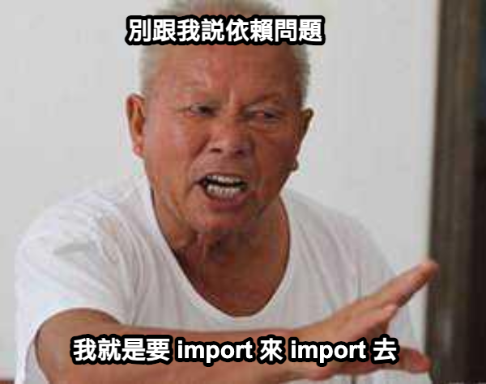

# 前端也可以搞微服務？！前端最複雜的一種架構

## Monorepo

這是一種專案的架構方式，但依然要從這幾種來分門別類。

- Monolith Repo
- Multi Repo
- Mono Repo

### Monolith Repo

首先是 Monolith Repo，也就是俗稱的單體式架構，用一個 Repository 管理專案全部的檔案。好處很明顯，簡單、易學、好管理，大部分你所看到的公司專案幾乎是使用這種方式。沒錯，就是各種東西一大鍋放進去，任何變數、組件、函式要用都可以很開心 import 來 import 去。

### Multi Repo

第二個要討論的是 Multi Repo，當你覺得有些東西實在過於龐大，那很可能會開始想拆出去到不同的 Repository。這可以很好的控制專案規模大小，盡可能減低原先專案的總體大小，也可以更容易分割職責讓更多人員去進行維護與管理。但確實有很大的缺點，當你拆出去的同時，共用這件事就會變成一個非常困擾的的難題，每一個拆出去的東西為了讓模組共用，你又得再拆共用的模組共用的儲存庫，工作量顯得更多。因為要解決共用困難，開始有人搭配使用 GitSubmodule 來維護管理，就開始遊走於 Mono Repo 之間。但畢竟還是外掛性質，管理起來不免沈重，也帶來相當多困擾。

### Mono Repo

近年很流行 Mono Repo，個大框架和函式庫紛紛採用這種作法。那為什麼 Mono Repo 行之有年，過去使用的人不多呢？
其實主因在於過去的 Mono Repo 是仰賴 GitSubmodule 的實現，但隨著 npm workspace 的成熟，各方工具出現，包含 yarn workspace, pnpm workspace, lerna, nx 等等工具興起，JavaScript 實現 Mono Repo 這件事變得更加簡單。但 Mono Repo 並非全能靈藥，一個 Repository 的大小成長已經漸漸會負擔，也勢必會沈重起來，適當再拆成 Multi Repo 也不是不好的，Mono Repo 成為一個很好的過渡方案。

### MonoRepo 跟微前端什麼關係？

先說結論：「沒有任何毛關係」

奇怪？各大討論微前端都會談到 MonoRepo，但為什麼沒有任何關係？其實 MonoRepo 就是一個專案管理手法，剛開始製作微前端時也是各種需要共用情境，你可能不知道如何拆模組，也可能各種東西黏在一起不知道如何解耦。但 MonoRepo 提供了一個管理方式，在熟悉微前端這樣的架構前可以有效管並穩定的理整個專案。加上近年 MonoRepo 的盛行，多多少少就很容易被同時拿出來討論，但 MonoRepo 本身跟微前端定義直接相關，只是發布上多少可以說採用分散部署的概念去建構。

### Resource

- [GitSubmodule](https://git-scm.com/book/en/v2/Git-Tools-Submodules)
- [該用 Monorepo 嗎？比較 Monolith vs Multi-Repo vs Monorepo](https://www.cythilya.tw/2023/01/28/monolith-vs-multi-repo-vs-mono-repo/)
- [Monorepo vs. multi-repo](https://www.thoughtworks.com/insights/blog/agile-engineering-practices/monorepo-vs-multirepo)
