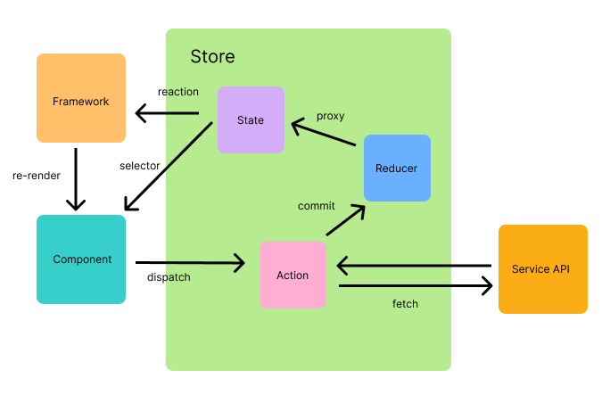

# 前端也可以搞微服務？！前端最複雜的一種架構

## 狀態管理器

這其實完全可以講很長一篇，但我基本上長話短說（其實是不想寫那麼多，好累...）

這是一個現在前端常見的狀態管理器架構，一個狀態管理器最基本需要幾個元素。分別是 `state`, `mutation`, `updatedEvent`，不管你怎麼精簡這些都是必要的。

- state: 負責儲存狀態。
- mutation: 負責修改狀態。
- updatedEvent: 負責在 mutation 當下判斷 state 是否發生修改，如果發生異動則發出事件。

很多詞彙其實沒有標準用語，大概去理解到含義就可以。

### 標準的狀態管理機設計模式

一個狀態管理機除了上述基本的設計，其實要擴張或是深入設計都有對應的做法。

從 state 開始說，不管狀態機是全域共用或是存在於某個 Context 之下，Normal 狀態最好都是 Lock 的，Lock 時是不可被讀取不可被修改，如果需要讀取及修改需要執行 `Entry` 的動作，狀態才能被解鎖並可以跟狀態進行 `Transaction`，結束時執行 `Exit` 動作。這種設計就是 Finite State Machine (FSM)，要能監測操作才可以做更多的處理。

以取得資料這件事，監測某個時段發生的 `Transaction` 可以進行依賴收集，能夠更加精準的提供 Effect Scope。但如果取得的時間點跟實際使用的時間點有落差，那對監測就會發生誤差，這時依賴收集就會變得不精準。

以修改這件事，通常要確定被修改的 Effect Scope 才能提供切確的監測範圍。另一個議題是批次修改，如果發生多個狀態修改需要在一個 dispatch 中用單一的 Event 去通知訂閱的個修改事件的對象，如果沒有明確的「開始」與「結束」也會很難偵測。甚至有需要狀態同步的需求時，通知改變會是一件很重要的事情。

### 微前端應用的狀態管理

通常進行狀態管理都優先建議採用同步單向資料流，主要是怕資料流混亂，如果沒有單向資料流，難以追蹤修改的依賴路線。為了做單向資料流，你就要控制修改狀態的 API 盡量是單一的，比較容易進行監測與追蹤。如此一來，在整個微前端應用下需要互相共享的狀態可以透過「相互狀態同步」或「單一狀態源」兩種方式去進行狀態共享。但要特別小心非同步的修改，很容易發生資源競爭 (Race Condition) 問題，所以遇到非同步的狀態可能要有一套判斷機制去 merge 非同步的修改。

### Resource

- [Behavioral Design Patterns - State](https://refactoring.guru/design-patterns/state)
- [wikipedia - Finite-state_machine](https://en.wikipedia.org/wiki/Finite-state_machine)
