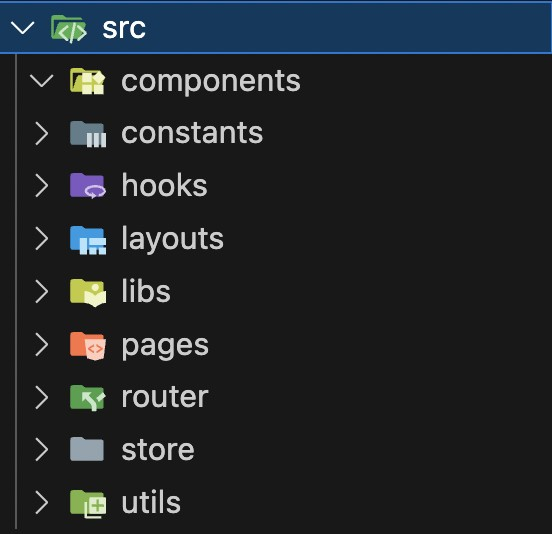
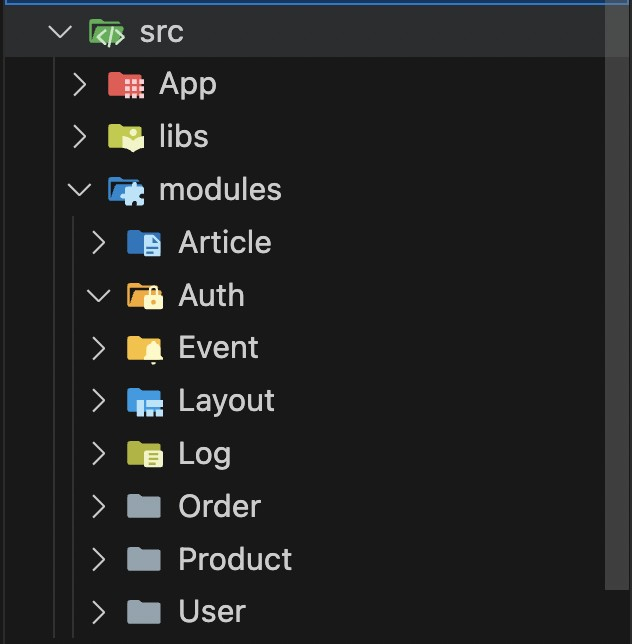
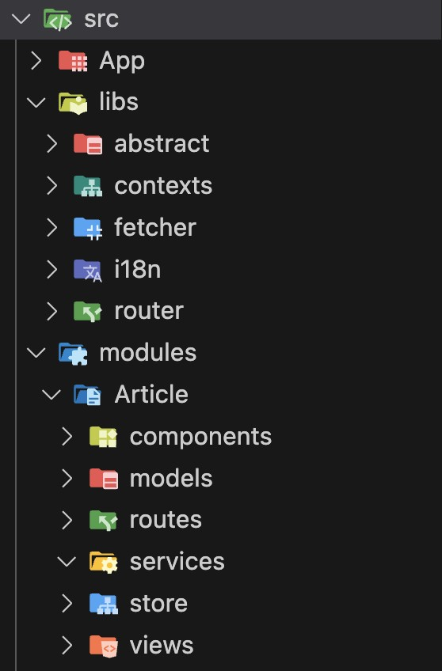

# 前端也可以搞微服務？！前端最複雜的一種架構

## DDD 大型前端架構

通常小型到中型專案時，都會習慣使用 pages, components, store... 等等命名在分類功能資料夾，但相似的功能模組就會散落在許多資料夾之中。

### Domain Driven Design

Domain Driven Design (DDD)，把每個領域拆分成獨立的業務模組，這種設計系統的方式在微服務領域盛行一段時日。大部分的人都會認為「前端」不適合跑 DDD，因為前端像是大鍋菜一樣，是各方業務邏輯混雜的區域。然而我在實作「前端 DDD」的過程中意外的體驗到他的優勢，特別是在微前端能夠享受到最大的效益，這就是為什麼我會特別提出這個設計。

### Folder Structure

以一般前端習慣的資料夾結構如下：

你會發現多半以「功能類型」來區分，好處是你可以快速找到你要的功能，也最大幅度可以重用模組，防止重複不斷去寫相似的東西。但隨著你的功能越來越多，你會發現開始有點找不到東西，每次資料夾攤開來東西都很多，也常常改來改去互相影響。

如果開始想做 DDD 之後，你的資料夾會開始長成這樣：

你會使用以「領域類型」作為核心分類，不斷橫向拓展。然而在維持領域分類時你會開始讓領域與領域之間去互相依賴，接著你就會碰上 Circular Dependency 的議題，因為你會將模組相互依賴，領域模組之間關係變得模糊。這時應該搭配前面所提起的「微前端溝通」、「插件系統」兩大方式去處理，達到依賴反轉與解耦。大概從這些點就會知道，領域模組與領域模組之間是不應該相互依賴的，他們必須基於相同的 Abstract 去實作，每個模組之間才會相對獨立。只要能滿足這種存粹依賴 context 溝通的法則，逐漸就可以隔離每個模組間的耦合關係。

### 為什麼合適於微前端？

通常團隊很少會用「功能類型」來做職責拆分，就算有職責拆分邏輯也會多傾向採用 Npm package 來拆分。而微前端多半是利用團隊來拆分，而團隊適用 Domain Knowhow
來拆職務內容，這架構就很適合分類每個團隊職責，也讓功能更容易被分類，只要團隊 Follow 同一個抽象介面，就容易去擴展功能。
